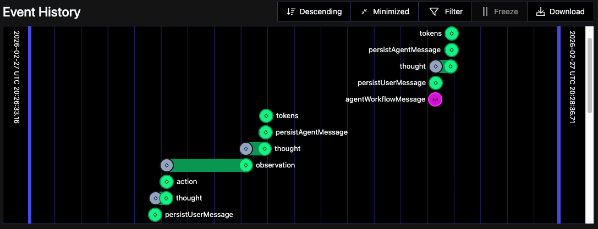
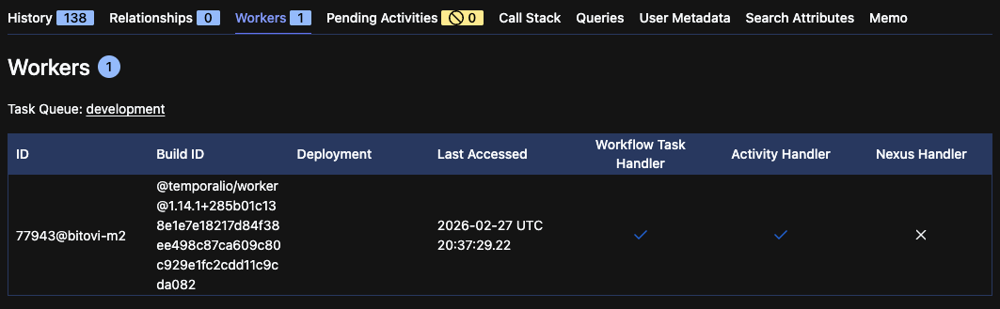

After three years of iterative development on Hennos, my personal AI assistant project, it had become clear that the original architecture needed a major overhaul. The assistant had grown from a simple Telegram bot into a much larger multi-platform system supporting multiple LLM providers, several different chat clients, and a wide array of tools. But the original system that was designed around Telegram specifics was making it hard to seperate the core logic from the platform-specific interactions. There was a lot of duplicated logic, complex workarounds, and it was time for a fundamental rewrite.

This post documents the architectural transformation of Hennos from a simple handler-based system to a Temporal-powered workflow orchestration system. If you haven't read Part 1, check out [Hennos Assistant V1](/posts/hennos-assistant-v1/) to understand the foundation we're building on.

## Why Rewrite?

The original architecture worked well for simple interactions, but three problems became critical:

1. **Complexity**: Adding a new chat platform required significant changes to the core logic, making it hard to maintain and extend.
2. **Database Limitations**: The original database schema was not designed to handle anything other than Telegram-specific data, making it difficult to support multiple platforms and tools.
3. **Observability**: Debugging conversation flow meant digging through logs. There was no way to see the "state" of an active conversation or replay failures.

I needed a system that could handle durable, long-running conversations with built-in state management, retries, and visibility.

## What is Temporal?

[Temporal](https://temporal.io/) is a workflow orchestration platform. With Temporal, the core logic of your application is written as **Workflows**, durable functions that can run for days, months, or even years. These Workflows coordinate **Activities**, individual tasks such as calling an LLM, executing a tool, or interacting with external systems. As the Workflow executes, Temporal automatically persists the state to a database. If the process crashes, the Workflow can resume exactly where it left off. Similar, for Activities, if an Activity fails, Temporal can retry it based on configurable policies.

Even better, all of this can be observed and queried in real-time through Temporal's web UI.

For Hennos, this means:

- Conversations are **durable workflows** that persist indefinitely
- Each message is a **signal** that advances the conversation
- LLM calls and tool executions are **activities** with automatic retries
- The entire conversation history and state is queryable and observable in real-time

## The New Architecture

The `temporal-worker` branch introduces several Workflow types, each serving a specific purpose:

### 1. Agent Workflow

The core of Hennos V2. Each conversation (whether from Telegram, Discord, Slack, or the web API) gets its own agent workflow. The Workflow implements a thought-action-observation loop:

_This is simplified pseudo-code to illustrate the structure_

```typescript
export async function agentWorkflow(input: AgentWorkflowInput): Promise<void> {
  const context: string[] = input.continueAsNew
    ? input.continueAsNew.context
    : [];

  const pending: PendingMessage[] = input.continueAsNew
    ? input.continueAsNew.pending
    : [];

  let userRequestedExit = false;

  setHandler(agentWorkflowMessageSignal, (args: PendingMessage) => {
    pendingUserMessages.push(args);
  });

  setHandler(agentWorkflowExternalContextSignal, (args: string) => {
    context.push(args);
  });

  setHandler(agentWorkflowExitSignal, () => {
    userRequestedExit = true;
  });

  while (!userRequestedExit) {
    await condition(() => pendingUserMessages.length > 0 || userRequestedExit);

    if (userRequestedExit) break;

    // Process pending messages
    const userMessages = pendingUserMessages.splice(0);
    await activities.persistMessages(userMessages);

    // Think: Decide what to do
    const thought = await activities.think(context);

    if (thought.action === "respond") {
      await activities.sendResponse(thought.message);
    } else if (thought.action === "use_tool") {
      // Act: Execute the tool
      const result = await activities.executeTool(
        thought.tool,
        thought.parameters,
      );

      // Observe: Add result to history
      context.push(result);
    }

    // Re-evaluate after every action
  }
}
```

This pattern is based on the popular Reasoning and Acting (ReAct) Agent architecture. The workflow maintains conversation history, processes incoming signals, calls the LLM to decide what to do, executes tools if needed, and loops. If the process crashes, Temporal restarts the workflow from its last persisted state. If a tool execution fails, the Workflow can catch the error and respond appropriately. If a call to OpenAI or other API fails, Temporal can retry it automatically based on configurable policies.

### 2. Signal-Based Communication

Instead of synchronous request-response, the temporal-worker uses **Signals** to communicate with workflows. Here's how the Telegram client routes messages:

```typescript
export async function handleTextMessage(msg: Message): Promise<void> {
  const chatId = msg.chat.id;
  const text = msg.text || "";

  // Get or create workflow for this conversation
  const workflowId = `telegram-${chatId}`;
  const handle = temporal.workflow.getHandle(workflowId);

  // Send signal to workflow
  await handle.signal("agentWorkflowMessageSignal", {
    platform: "telegram",
    chatId: chatId.toString(),
    userId: msg.from?.id.toString(),
    content: text,
    timestamp: new Date(),
  });
}
```

Signals are non-blocking. The Telegram bot sends the message signal and immediately returns. The workflow processes the signal when it's ready, potentially batching multiple signals together. This decoupling is critical for multi-platform support. In addition this makes it easy to add new platforms by simply sending signals to the same workflow.

### 3. Activities for LLM and Tools

Each individual task such as calling the LLM, executing a tool, or sending a response is implemented in an **activity**. Activities are functions that run outside the workflow, with configurable retry policies:

```typescript
export const activities = {
  think: async (conversationHistory: Message[]): Promise<ThoughtResponse> => {
    // Get the list of available Tools
    const availableTools = getAvailableTools();

    // Call LLM to decide next action
    const prompt = buildThoughtPrompt(conversationHistory, availableTools);

    const response = await llm.chat({
      messages: prompt,
      tools: [
        {
          name: "perform_action",
          description: "Decide what action to take next",
          parameters: {
            reasoning: {
              type: "string",
              description: "Your thought process behind using this Tool",
            },
            tool_name: {
              type: "string",
              description: "The name of the Tool to execute",
            },
            tool_input: {
              type: "object",
              description: "The input parameters for the Tool",
            },
          },
        },
      ],
    });

    // Determine if the LLM wants to use a Tool
    // or returned a String to respond with.
    return parseThoughtResponse(response);
  },

  executeTool: async (toolName: string, input: any): Promise<string> => {
    // Execute tool with retries
    const tool = getToolByName(toolName);
    return await tool.execute(input);
  },

  persistMessages: async (
    messages: AgentWorkflowMessageSignal[],
  ): Promise<void> => {
    await db.workflowMessage.createMany({ data: messages });
  },
};
```

Activities have automatic retries with exponential backoff. If an OpenAI call times out, Temporal retries it. If a Tool execution fails, the Workflow can catch the error and respond appropriately.

### 4. ContinueAsNew for Long Conversations

As a Workflow executes, over time it will start to accumulate state. All of the conversation history, inputs and outputs of Activities, pending Signals, etc. For conversations that last months or years this will eventually become a problem. Thankfully, Temporal provides a solution here as well. Workflows can perform a `continueAsNew`, which starts a new instance of the Workflow with an initial state that we define.

```typescript
export async function agentWorkflow(): Promise<void> {
  // ... signal handler code ...
  while (!shouldExit) {
    // ... ReAct Loop Logic ...

    const tokenCount = await tokens(context);
    const passedTokenLimit = tokenCount.tokenCount > tokenCount.tokenLimit;
    /**
     * ContinueAsNew if
     * - Temporal suggests it via workflowInfo().continueAsNewSuggested
     * - The conversation is nearing the LLM context length
     */
    if (workflowInfo().continueAsNewSuggested || passedTokenLimit) {
      const compactContext = await compact({ context });
      return continueAsNew<typeof agentWorkflow>({
        context: compactContext,
      });
    }
  }
}
```

The workflow restarts with a clean slate, with the existing context replaced with a summarized and compacted version. To the user, the conversation is seamless. To Temporal, it's a fresh workflow with reduced memory footprint.

## Model Context Protocol (MCP) Integration

One of the biggest improvements in v2 is **dynamic tool loading**. The original Hennos had a bunch of hardcoded tools that were added simply to meet the use cases of the friends and family users as the project evolved. In v2, Tools are provided by **MCP servers**. These servers provide a standardized way to define tools and their capabilities. The original tools will continue to be available, but users will be able to configure their own MCP-defined tools and add them to Hennos themselves.

The Hennos API allows registering MCP servers per conversation:

```typescript
app.post("/api/conversations/:id/mcp-servers", async (req, res) => {
  const { conversationId } = req.params;
  const { name, command, args, env } = req.body;

  // Register with conversation
  await db.modelContextProtocolServer.create({
    data: {
      name,
      conversationId,
      command,
      args: JSON.stringify(args),
      env: JSON.stringify(env),
    },
  });

  res.json({ success: true, serverId: server.id });
});
```

When the user next sends a message, the Workflow will load the configured MCP servers and make their tools available for use in the conversation. This means that new tools and capabilities can be added to Hennos without redeploying the application.

## Multi-Platform Unification

One of the most powerful features of the temporal-worker rewrite is **unified mode**. In V1, each platform (Telegram, Discord) had isolated conversations. In V2, conversations can span platforms.

The database schema supports this via `WorkflowSession` and `WorkflowSessionLink`:

```typescript
model WorkflowSession {
  id              String   @id @default(uuid())
  workflowId      String   @unique
  createdAt       DateTime @default(now())
  updatedAt       DateTime @updatedAt

  messages        WorkflowMessage[]
  links           WorkflowSessionLink[]
  mcpServers      ModelContextProtocolServer[]
}

model WorkflowSessionLink {
  id              String   @id @default(uuid())
  sessionId       String
  platform        String   // "telegram", "discord", "slack", "web"
  platformUserId  String
  platformChatId  String

  session         WorkflowSession @relation(fields: [sessionId], references: [id])

  @@unique([platform, platformChatId])
}
```

A single workflow can have multiple links. You could start a conversation on Telegram, continue it on Discord, and finish on the web interface. The key here is that all messages are routed to the same underlying Workflow, so the context is preserved across platforms.

## Scheduled Workflows

Not all workflows respond to user messages. Hennos v2 introduces **scheduled workflows** for proactive tasks:

### Email Digest Workflow

```typescript
export async function emailDigestWorkflow(
  config: EmailDigestConfig,
): Promise<void> {
  while (true) {
    // Wait until next scheduled time (e.g., 8am daily)
    await sleep(config.scheduleInterval);

    // Fetch unread emails
    const emails = await activities.fetchEmails(config.emailAccount);

    // Summarize with LLM
    const summary = await activities.summarizeEmails(emails);

    // Update the chat history with the summary
    await activities.updateChatHistory(link.chatId, summary);
  }
}
```

This workflow runs indefinitely, waking up once per day to process emails. Temporal's durable timers ensure it never misses a run, even if the process restarts.

### Bluesky Digest Workflow

Similar to Email, the Bluesky Workflow runs on a schedule fetching posts and summarizing them for delivery to configured platforms.

```typescript
export async function blueskyWorkflow(
  config: BlueskyDigestConfig,
): Promise<void> {
  while (true) {
    await sleep(config.scheduleInterval);

    // Fetch Bluesky feed items
    const feedItems = await activities.fetchFeed(config);

    // Summarize with LLM
    const summary = await activities.summarizeFeedItems(feedItems);

    // Update the chat history with the summary
    await activities.updateChatHistory(config.chatId, summary);
  }
}
```

Now, when the user sends Hennos a message, it can have the additional context from their email inbox or Bluesky feed ready to go to provide a more informed response.

## Observability and Debugging

Temporal comes with a built in Web UI that can be used to monitor workflows. The Web UI shows the complete Event History of our Workflow, all the inputs and outputs to Activities, incoming Signals, and more. It provides a great way to visualize what is happening in a Workflow and to debug issues.



This visibility is invaluable, especially for long-running conversations.

## Code Quality Improvements

The rewrite forced better separation of concerns:

- **Client Layer** (Telegram, Discord, Slack, API): Only handles I/O and signals. No business logic.
- **Workflow Layer**: Coordination and state management. No LLM calls or tool execution directly.
- **Activity Layer**: Pure functions for LLM calls, tool execution, database operations. Easy to test and reason about.
- **Singleton Services**: Shared clients (OpenAI, Anthropic, Temporal) initialized once.

Activities can be tested in isolation. Workflows can be tested with mock activities. Clients are thin wrappers around Workflow Signals.

## Performance and Reliability

- **Latency**: Similar to V1 for simple messages, Temporal adds minimal overhead.
- **Reliability**: No more lost conversations. Crashes are automatically recovered.
- **Scalability**: Workflows are lightweight. A single Temporal cluster can handle thousands of concurrent conversations.
- **Concurrency**: Multiple messages in rapid succession are batched in the workflow automatically, avoiding race conditions or the need for custom logic.

We can even see the workers that are associated with our Workflow in the Temporal Web UI:



Thanks to Temporals Workflow and Activity model, Hennos can also be horizontally scaled by adding more workers to the Temporal cluster.

## What's Next?

In order to transition from the original Hennos v1 into Hennos v2 I actually implemented a second Temporal Workflow, re-implementing the entire behavior of Hennos v1 with its existing database and storage backends. Once this re-implementation is completed it should be possible to swap over to the new codebase. From there, the plan is to gradually migrate users to the new system. Likely another Temporal Workflow will be used to migrate data from the original database and storage over to the new Agent Workflow-managed history and WorkflowMessage database tables.

The largest remaining feature actually exists outside of the Hennos repository. The completion of the Hennos Web client implementation will provide a user-friendly interface for interacting with Hennos as well as linking together conversations from the legacy system.

## Conclusion

Rewriting Hennos with Temporal transformed it from a chatbot into a **durable, multi-platform agent orchestration platform**. Conversations persist indefinitely. Tools are dynamically loaded. Workflows coordinate activities with retries and observability built-in.

If you're building an AI assistant that goes beyond simple request-response, consider workflow orchestration. The upfront complexity pays dividends in reliability, scalability, and developer experience.

I have also written more on this subject of Production Ready AI Agents for my consulting work at Bitovi. You can find that post [here](https://www.bitovi.com/blog/production-ready-ai-agents-making-langchain-durable-using-temporal) or many other AI-related blog posts [here](https://www.bitovi.com/blog).

---

_This is Part 2 of a series on Hennos. Read [Part 1](/posts/hennos-assistant-v1/) to learn about the original architecture and evolution._
